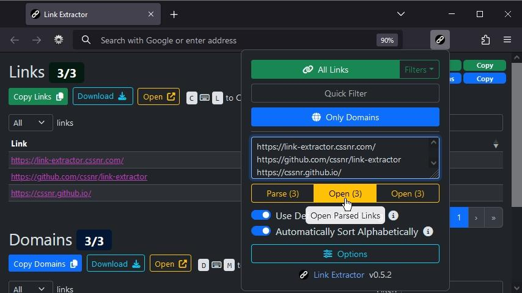

# Link Extractor

Modern Chrome Web Extension and Firefox Browser Addon to easily extract, parse,or open all links/domains from a site or text with optional filters.
Feature packed with automatic dark/light mode, copy to clipboard, keyboard shortcuts, custom options, and much more...

Website: https://link-extractor.cssnr.com/

- [Install](#Install)
- [Features](#Features)
  - [Upcoming Features](#Upcoming-Features)
  - [Known Issues](#Known-Issues)
- [Configuration](#Configuration)
- [Support](#Support)
- [Contributing](#Contributing)

## Install

- [Google Chrome Web Store](https://chromewebstore.google.com/detail/link-extractor/ifefifghpkllfibejafbakmflidjcjfp)
- [Mozilla Firefox Add-ons](https://addons.mozilla.org/addon/link-extractor)
- [Microsoft Edge Add-ons](https://microsoftedge.microsoft.com/addons/detail/link-extractor/nmndaimimedljcfgnnoahempcajdamej)

All **Chromium** Based Browsers can install the extension from the
[Chrome Web Store](https://chromewebstore.google.com/detail/link-extractor/ifefifghpkllfibejafbakmflidjcjfp).

Mobile browser support available for
[Firefox](https://addons.mozilla.org/addon/link-extractor) and
[Yandex](https://chromewebstore.google.com/detail/link-extractor/ifefifghpkllfibejafbakmflidjcjfp).

## Features

Please submit a [Feature Request](https://github.com/cssnr/link-extractor/discussions/new?category=feature-requests)
for new features. For any issues, bugs or concerns; please [Open an Issue](https://github.com/cssnr/link-extractor/issues/new).

- Extract All Links and Domains from Any Site
- Extract Links from Selected Text on any Site
- Extract Links from Clipboard or Any Text
- Extract Links from All Selected Tabs
- Extract Links from PDF Documents
- Copy Selected Links with right-click Menu
- Display Additional Link Details and Text
- Open Multiple Links in Tabs from Text
- Download Links and Domains as a Text File
- Copy the Text from a Link via Context Menu
- Quick Filter Links with a Regular Expression
- Store Regular Expressions for Quick Filtering
- Import and Export Saved Regular Expressions
- Automatic Dark/Light Mode based on Browser Setting
- Activate from Popup, Context Menu, Keyboard Shortcuts or Omnibox

### Upcoming Features

- Option to Extract Links from All Text Files (PDF Extraction currently in Beta)
- Option to Set Names/Titles for Saved Filters
- Option to Extract Using Multiple Filters with AND/OR

> [!TIP]
> Don't see your feature here?
> Request one on the [Feature Request Discussion](https://github.com/cssnr/link-extractor/discussions/categories/feature-requests).

### Known Issues

See the [Support](#Support) section for ways to inform us about issues...

For more information see the [FAQ](https://link-extractor.cssnr.com/faq/).

## Configuration

- [View Configuration Documentation on Website](https://link-extractor.cssnr.com/docs/#configure)

You can pin the Addon by clicking the `Puzzle Piece`, find the Link Extractor icon, then;  
**Chrome,** click the `Pin` icon.  
**Firefox,** click the `Settings Wheel` and `Pin to Toolbar`.

To open the options, click on the icon (from above) then click `Open Options`.  
You can also access `Options` through the right-click context menu (enabled by default).  
Here you can set flags and add as many saved regular expressions as you would like for easy use later.  
Make sure to click`Save Options` when finished.

For more information on regex, see: https://regex101.com/

## Support

For help using the web extension or to request features, see:

- Documentation: https://link-extractor.cssnr.com/docs/
- Q&A Discussion: https://github.com/cssnr/link-extractor/discussions/categories/q-a
- Request a Feature: https://github.com/cssnr/link-extractor/discussions/categories/feature-requests

If you are experiencing an issue/bug or getting unexpected results, you can:

- Report an Issue: https://github.com/cssnr/link-extractor/issues
- Chat with us on Discord: https://discord.gg/wXy6m2X8wY
- Provide General Feedback: [https://cssnr.github.io/feedback/](https://cssnr.github.io/feedback/?app=Link%20Extractor)

Logs can be found inspecting the page (Ctrl+Shift+I), clicking on the Console, and;
Firefox: toggling Debug logs, Chrome: toggling Verbose from levels dropdown.

# Contributing

Please consider making a donation to support the development of this project
and [additional](https://cssnr.com/) open source projects.

For instructions on building, testing and submitting a PR, see [CONTRIBUTING.md](CONTRIBUTING.md).

Additionally, you can give a 5-star rating
on [Google](https://chromewebstore.google.com/detail/link-extractor/ifefifghpkllfibejafbakmflidjcjfp)
or [Mozilla](https://addons.mozilla.org/addon/link-extractor) and star this project on GitHub.

Other Web Extensions I have created and published:

- [Link Extractor](https://github.com/cssnr/link-extractor?tab=readme-ov-file#readme)
- [Open Links in New Tab](https://github.com/cssnr/open-links-in-new-tab?tab=readme-ov-file#readme)
- [Auto Auth](https://github.com/cssnr/auto-auth?tab=readme-ov-file#readme)
- [Cache Cleaner](https://github.com/cssnr/cache-cleaner?tab=readme-ov-file#readme)
- [HLS Video Downloader](https://github.com/cssnr/hls-video-downloader?tab=readme-ov-file#readme)
- [SMWC Web Extension](https://github.com/cssnr/smwc-web-extension?tab=readme-ov-file#readme)
- [PlayDrift Extension](https://github.com/cssnr/playdrift-extension?tab=readme-ov-file#readme)
- [ASN Plus](https://github.com/cssnr/asn-plus?tab=readme-ov-file#readme)
- [Aviation Tools](https://github.com/cssnr/aviation-tools?tab=readme-ov-file#readme)
- [Text Formatter](https://github.com/cssnr/text-formatter?tab=readme-ov-file#readme)

For a full list of current projects visit: [https://cssnr.github.io/](https://cssnr.github.io/)
